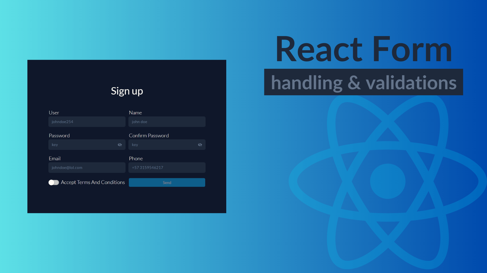

# Validation form

## Installation

- `pnpm i` or `npm i`

## Skills:

- React ⚛
- TypeScript (TS)
- React Icons
- React Context API

> The main objective of this project is to create a form that allows validating the fields and changing the theme of the page. Clicking a button will change the theme of the page, affecting the visual style of the form and other UI elements.
